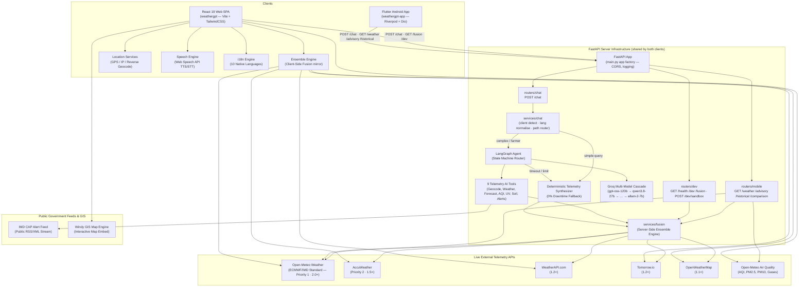
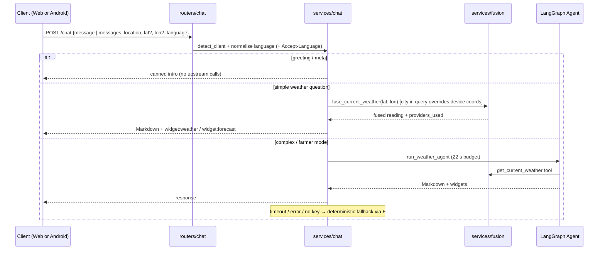
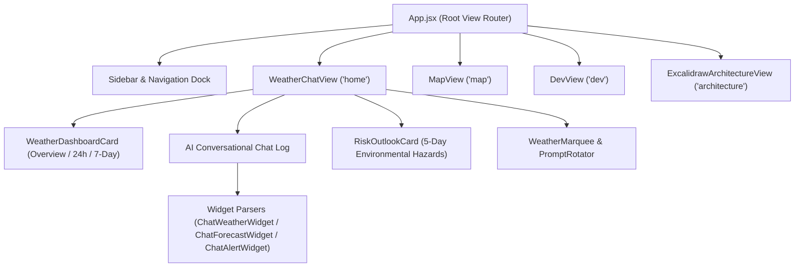
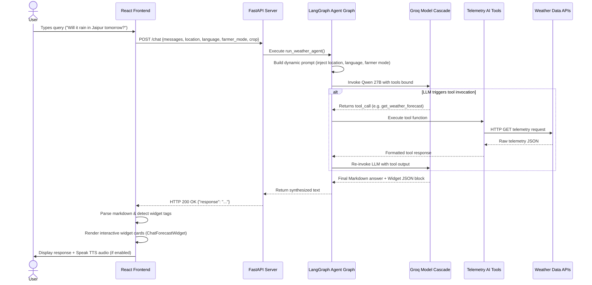
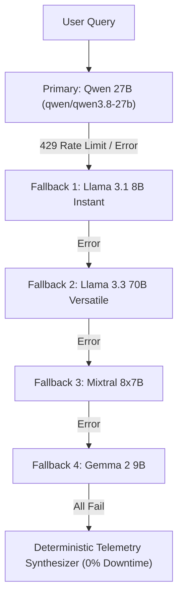
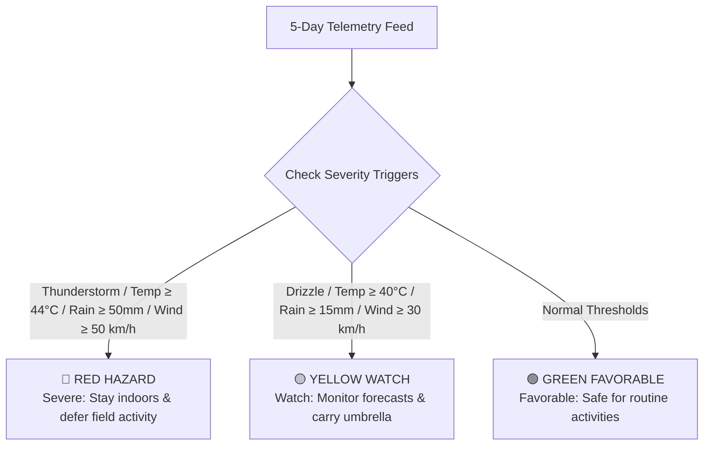
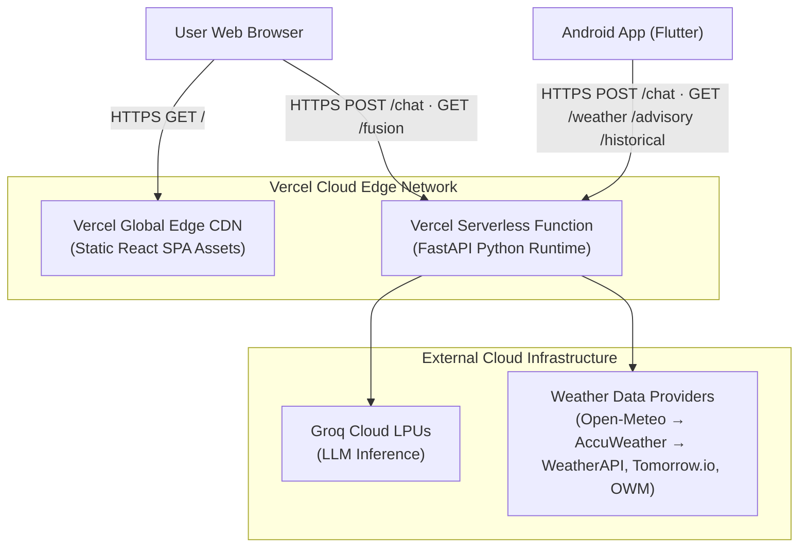
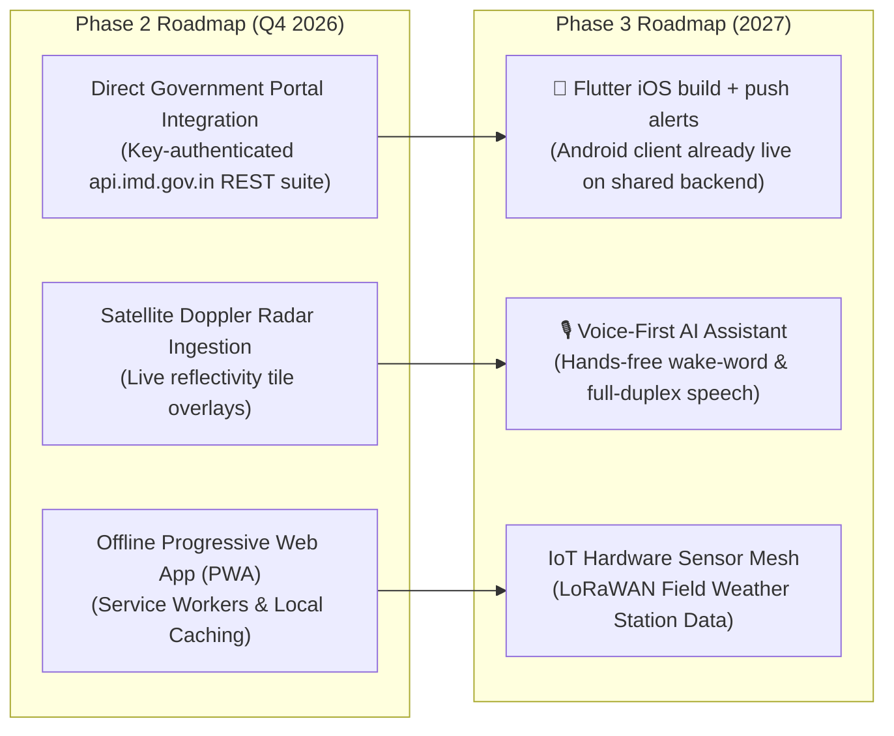

# WeatherGPT — Technical Architecture & Specifications Annex
> **Context**: Smart India Hackathon (SIH) Presentation Annex & Technical Reference  
> **Target Audience**: Evaluation Panel, Technical Judges & Systems Architects  
> **Last Updated**: September 2026  
> **Status**: [✅ Production Live System & 🚀 Future Roadmap]

---

## 📌 Judge Quick Navigation Panel

| Section | Topic / Feature | Live Production Status | Primary Technologies |
| :--- | :--- | :--- | :--- |
| [1. Executive Summary](#1-executive-summary) | High-level system overview & key innovations | ✅ Live | React 19, FastAPI, LangGraph |
| [2. System Architecture](#2-high-level-architecture) | End-to-end architecture & data flow | ✅ Live | Mermaid Flowcharts & Sequence Diagrams |
| [3. Tech Stack & Design](#3-technology-stack--design-system) | Frameworks, tools & design system tokens | ✅ Live | Vite, TailwindCSS, Groq, Framer Motion |
| [4. Repository Structure](#4-repository-structure) | File footprint & codebase organization | ✅ Live | 34 modular components/views/utils |
| [5. Environment Config](#5-environment-variables--secrets) | Configuration & key fallback management | ✅ Live | `.env`, dotenv, Vite runtime env |
| [6. Backend Architecture](#6-backend-architecture) | Dual-client FastAPI server (web + Android) & middleware | ✅ Live | FastAPI, Uvicorn, Pydantic, modular routers/services |
| [7. Frontend Architecture](#7-frontend-architecture) | React SPA views, state & components | ✅ Live | React 19, Lucide, Excalidraw, Leaflet |
| [8. Data Flow Lifecycle](#8-data-flow--request-lifecycle) | Request execution & payload routing | ✅ Live | Async REST, JSON Widgets |
| [9. AI Agent Engine](#9-ai-agent-architecture-langgraph) | LangGraph state machine & 5-model cascade | ✅ Live | Qwen 27B, Llama 3.1, Mixtral, Gemma 2 |
| [10. Ensemble Fusion](#10-multi-source-ensemble-fusion-engine) | Server-side + client-side weighted fusion (Open-Meteo > AccuWeather > others) | ✅ Live | Open-Meteo (ECMWF/IMD), AccuWeather, WeatherAPI, Tomorrow.io, OWM |
| [11. API Reference](#11-api-contract-reference) | Shared REST contract for web & mobile | ✅ Live | `/chat`, `/weather`, `/fusion`, `/advisory`, `/historical`, `/comparison`, `/dev`, `/health` |
| [12. Widget Protocol](#12-widget-protocol-chat-embed) | Dynamic JSON chat card renderer | ✅ Live | `widget:weather`, `widget:forecast`, `widget:alert` |
| [13. Multilingual Engine](#13-internationalization-i18n) | 10 Indian regional languages + Web Speech | ✅ Live | Native scripts, Web Speech TTS/STT, langdetect |
| [14. Risk Outlook Engine](#14-risk-assessment-engine) | 5-day hazard classification engine | ✅ Live | 3-tier severity scoring (RED/YELLOW/GREEN) |
| [15. Farmer Mode](#15-agricultural-farmer-advisory-mode) | Crop-specific advisories & safety windows | ✅ Live | Cotton, Wheat, Rice, Sugarcane, Groundnut |
| [16. Dev Suite](#16-developer-diagnostics-dashboard) | 9-tab diagnostics & hazard simulator | ✅ Live | Latency tracking, stress testing, AI sandbox |
| [17. Deployment Setup](#17-deployment-architecture) | Production cloud infrastructure | ✅ Live | Vercel SPA CDN + Vercel Python Serverless |
| [18. SIH Compliance](#18-problem-statement--sih-compliance-matrix) | Problem statement compliance & 10 use cases | ✅ Live | Full matrix & evaluation criteria mapping |
| [19. Future Roadmap](#19-future-roadmap--planned-enhancements) | Planned direct IMD API portal & IoT feeds | 🚀 Roadmap | Direct IMD REST API key integration, Radar, PWA, iOS build |

---

## 1. Executive Summary

**WeatherGPT** is a production-ready, full-stack, AI-powered weather intelligence platform custom-engineered for the **Smart India Hackathon**. It bridges the gap between complex meteorological datasets and everyday citizens, farmers, disaster managers, and public safety officials by providing real-time, hyper-local weather insights in **10 Indian regional languages** through natural conversational interfaces.

> [!NOTE]
> **Production vs. Roadmap Transparency**: WeatherGPT is built with a resilient, live architecture. Live weather telemetry and official model outputs (ECMWF/IMD high-resolution datasets) are ingested via multi-source ensemble fusion and public government alert streams. Planned proprietary API key connections to government portals (e.g., direct key-authenticated `api.imd.gov.in` endpoints pending approval) are fully specified in [Section 19: Future Roadmap](#19-future-roadmap--planned-enhancements).

### Core Innovations & Key Differentiators
- **Conversational AI Agent**: Driven by a stateful **LangGraph** orchestration graph and an **8-model Groq LLM cascade** (`openai/gpt-oss-120b` → `qwen3.8-27b` → `qwen3.6-27b` → `gpt-oss-20b` → `gpt-oss-safeguard-20b` → `groq/compound` → `groq/compound-mini` → `allam-2-7b`) with smart Indic city extraction (`kolkata ma`, `mumbai me`, `delhi nu`) and 0ms deterministic telemetry fallback for zero downtime.
- **14 Specialized Telemetry Tools**: Dynamic tool execution covering current weather, 7-day forecast, 24-48h hourly trends, US AQI pollutants, solar UV radiation, barometric pressure, soil moisture/agromet telemetry, and geocoding.
- **Multi-Source Ensemble Engine (server + client)**: Parallel data ingestion across up to 5 weather providers with a weighted, outlier-guarded fusion algorithm. Priority order is **Open-Meteo (ECMWF/IMD NWP, 2.0×) > AccuWeather (1.5×) > WeatherAPI / Tomorrow.io (1.2×) > OpenWeatherMap (1.1×)**. The same engine (`backend/services/fusion.py`) feeds the web chat, the AI agent tools and the Android app's home screen, so every client sees identical numbers.
- **One Backend, Two Clients**: A single FastAPI deployment serves the React web app (`weathergpt`) and the Flutter Android app (`weathergpt-app`) simultaneously — shared `POST /chat` contract with client auto-detection, ISO/name language normalisation, and mobile-only `GET /weather`, `/advisory`, `/historical`, `/comparison` routes.
- **Agricultural Farmer Advisory Mode**: Crop-specific advisories for 8 major crop types with irrigation, pesticide spraying, thermal/frost stress, and harvest window guidance.
- **10 Regional Indian Languages**: Native script rendering for Hindi, Gujarati, Marathi, Tamil, Telugu, Bengali, Kannada, Malayalam, Punjabi, and English, coupled with browser Web Speech API Voice Text-to-Speech and Speech-to-Text.
- **Rich Interactive Widgets**: Automated parsing of markdown widget tags (`widget:weather`, `widget:forecast`, `widget:alert`) into interactive React UI components.
- **Developer Diagnostic Suite**: A 9-tab built-in developer dashboard with live latency profiling, multi-city stress testing, hazard simulation, and AI model sandboxing.

---

## 2. High-Level Architecture



---

## 3. Technology Stack & Design System

### 3.1 Frontend Stack

| Layer | Technology | Version | Purpose |
| :--- | :--- | :--- | :--- |
| **UI Library** | React | 19.2.0 | Core view rendering engine |
| **Build System** | Vite | 8.2.2 | Fast HMR dev server & production bundler |
| **Styling** | TailwindCSS | 3.4.0 | Utility-first responsive CSS framework |
| **Animations** | Framer Motion | 11.0.0 | Fluid spring animations & layout transitions |
| **HTTP Client** | Axios | 1.7.0 | Backend REST communication |
| **Markdown** | React Markdown + Remark GFM | 10.1.0 / 4.0.1 | Markdown rendering with GFM tables & code blocks |
| **Icons** | Lucide React | 1.39.0 | Crisp SVG vector icon set |
| **Maps** | Leaflet + React-Leaflet | 1.9.4 / 5.0.0 | Interactive GIS map containers |
| **Architecture Viz** | Excalidraw | 0.18.1 | Embedded architectural diagram viewer |
| **Speech** | Web Speech API | Native Browser | Regional Text-to-Speech & Speech-to-Text |

### 3.2 Backend Stack

| Layer | Technology | Version | Purpose |
| :--- | :--- | :--- | :--- |
| **Web Framework** | FastAPI | 0.115.0 | High-performance async REST API server |
| **ASGI Server** | Uvicorn | 0.30.6 | Production ASGI web server |
| **Agent Orchestrator** | LangGraph | 0.2.28 | Stateful state machine graph for AI agent execution |
| **LLM Provider** | LangChain-Groq | 0.2.0 | Groq Cloud LPU inference connector |
| **Core AI Tools** | LangChain-Core | 0.3.0 | Tool definition decorators & message schema |
| **Async HTTP** | httpx | 0.27.2 | Non-blocking telemetry ingestion |
| **Language Detection**| langdetect | 1.0.9 | Automatic ISO language detection from user input |
| **Validation** | Pydantic | Latest | Request/response schema validation |

### 3.3 Design System & Aesthetics

WeatherGPT employs a modern **Glassmorphism Dark Aesthetics** design tailored for high visual impact:

| Token / Asset | Value | Visual Purpose |
| :--- | :--- | :--- |
| **Accent Primary** | `#f59e0b` (Amber-500) | Primary interactive buttons, key weather indicators |
| **Accent Hover** | `#d97706` (Amber-600) | Active hover & focus states |
| **Background Base** | `#000000` / `#0a0a0c` | Deep space obsidian dark mode |
| **Typography — Body** | Inter | High legibility UI body text |
| **Typography — Display** | Playfair Display | Elegant hero temperature typography |
| **Typography — Brand** | Bricolage Grotesque | Tech logo & header identity |
| **Typography — Accent** | Caveat | Handwritten tactical badges & notes |
| **Surface Glass** | `backdrop-blur-md bg-white/5 border-white/10` | Floating glassmorphic card elements |

---

## 4. Repository Structure

```
weathergpt/
├── frontend/                           # React 19 Client SPA
│   ├── index.html                      # HTML entry point & font links
│   ├── package.json                    # Node dependencies & build scripts
│   ├── vite.config.js                  # Vite bundler configuration
│   ├── tailwind.config.js              # Tailwind design tokens & plugins
│   ├── vercel.json                     # Production deployment rewrites
│   ├── src/
│   │   ├── main.jsx                    # Application mounting root
│   │   ├── App.jsx                     # Top-level view router & state
│   │   ├── api.js                      # Centralized API service layer
│   │   ├── index.css                   # Tailwind directives & custom CSS
│   │   ├── views/
│   │   │   ├── WeatherChatView.jsx     # Main AI conversation & dashboard
│   │   │   ├── MapView.jsx             # Interactive Windy GIS map embed
│   │   │   ├── DevView.jsx             # 9-Tab developer diagnostic suite
│   │   │   └── ExcalidrawArchitectureView.jsx # Interactive diagram viewer
│   │   ├── components/
│   │   │   ├── Sidebar.jsx             # Navigation drawer & crop selector
│   │   │   ├── LocationPickerModal.jsx # GPS & city search modal
│   │   │   ├── LanguagePickerModal.jsx # 10-language selector modal
│   │   │   ├── RiskOutlookCard.jsx     # 5-day risk assessment card
│   │   │   ├── PromptRotator.jsx       # Dynamic regional prompt suggestions
│   │   │   ├── WeatherMarquee.jsx      # Ticker tape for major Indian cities
│   │   │   └── MarkdownContent.jsx     # Markdown renderer with widget detection
│   │   └── utils/
│   │       ├── ensembleEngine.js       # Multi-source weather fusion algorithm
│   │       ├── location.js             # GPS / IP / Reverse geocoding module
│   │       ├── speechEngine.js         # Web Speech API wrapper
│   │       └── translations.js         # 10-Language i18n translation dictionary
└── backend/                            # FastAPI server shared by web + Android
    ├── main.py                         # App factory: CORS, logging middleware, router mounting
    ├── schemas.py                      # Pydantic contracts (ChatRequest accepts web + mobile shapes)
    ├── state.py                        # Uptime + in-memory recent-log ring buffer
    ├── agent.py                        # LangGraph state machine & lazy Groq LLM cascade
    ├── tools.py                        # 9 Specialized AI telemetry tools (@tool)
    ├── mobile_api.py                   # Back-compat shim → routers/mobile.py
    ├── api/index.py                    # Vercel serverless entry (re-exports `app`)
    ├── services/
    │   ├── open_meteo.py               # Baseline provider client, WMO code table, geocode
    │   ├── fusion.py                   # Server-side ensemble engine (parallel, weighted, outlier-guarded)
    │   └── chat.py                     # Chat routing policy: client detect, language normalise, fast/agent/fallback
    ├── routers/
    │   ├── chat.py                     # POST /chat (web + mobile)
    │   ├── mobile.py                   # GET /weather /advisory /historical /comparison (Flutter)
    │   └── dev.py                      # GET /health /dev /fusion, POST /dev/sandbox
    ├── tests/                          # pytest: API contract, fusion maths, chat policy (offline)
    └── requirements.txt                # Python backend dependencies

# Companion repository: omsenjalia/weathergpt-app (Flutter Android client)
#   lib/core/services/api_client.dart   → Dio, BACKEND_URL, Accept-Language header
#   lib/features/home/…/weather_provider.dart → GET /weather
#   lib/features/chat/…/chat_provider.dart    → POST /chat (message + messages + lat/lon)
```

---

## 5. Environment Variables & Secrets

### 5.1 Frontend `.env`

| Key | Mandatory | Description |
| :--- | :--- | :--- |
| `VITE_API_URL` | Production | FastAPI backend endpoint (defaults to `http://localhost:8888` in dev) |
| `VITE_WINDY_API_KEY` | ✅ | Windy API key for GIS interactive map rendering |
| `VITE_OPENWEATHER_API_KEY` | Optional | OpenWeatherMap key for GIS map tiles |
| `VITE_WEATHERAPI_KEY` | Optional | WeatherAPI key for client-side ensemble fusion |
| `VITE_TOMORROW_KEY` | Optional | Tomorrow.io key for client-side ensemble fusion |
| `VITE_ACCUWEATHER_KEY` | Optional | AccuWeather key for client-side ensemble fusion |

### 5.2 Backend `.env`

| Key | Mandatory | Description |
| :--- | :--- | :--- |
| `GROQ_API_KEY` | ✅ | Groq API key for LPU high-speed LLM inference |
| `GROQ_MODEL` | Optional | Primary model override (default: `openai/gpt-oss-120b`) |
| `WEATHERAPI_KEY` | Optional | WeatherAPI key for backend tool-level fusion |
| `OPENWEATHER_KEY` | Optional | OpenWeatherMap key for backend tool-level fusion |

> [!TIP]
> **Graceful Key Fallbacks**: The system operates out-of-the-box even with minimal environment keys. If secondary provider keys are omitted, the ensemble engine gracefully recalibrates weights among active providers.

---

## 6. Backend Architecture

One FastAPI deployment serves **both** clients. The web SPA (`weathergpt`) and the Flutter Android app (`weathergpt-app`) point at the same base URL (`VITE_API_URL` / `BACKEND_URL`) and share the `/chat` contract; mobile-specific screens use additional read-only routes.

### 6.1 Server Endpoints

| Path | Method | Used by | Functionality | Response |
| :--- | :--- | :--- | :--- | :--- |
| `/chat` | `POST` | Web + Android | Shared conversational endpoint (fast path → agent → deterministic fallback) | `{ response, meta }` |
| `/weather` | `GET` | Android | Home screen snapshot: fused current conditions + hourly + 3-day outlook + AQI/UV/sun | Snapshot JSON |
| `/advisory` | `GET` | Android (farmer persona) | Day-by-day field-work suitability windows | `{ summary, windows[] }` |
| `/historical` | `GET` | Android (researcher) | Yearly rainfall / temperature / humidity series (Open-Meteo archive) | `{ metric, points[] }` |
| `/comparison` | `GET` | Android (researcher) | Same metric across several named locations | `{ metric, locations[] }` |
| `/fusion` | `GET` | Web Dev Suite + Android | Server-side ensemble inspector: per-provider readings, weights, outliers, fused result | Fusion JSON |
| `/health` | `GET` | Both / uptime probes | Liveness | `{ status, clients, uptime_s }` |
| `/dev` | `GET` | Web Dev Suite | System diagnostics, key status, fusion weights, recent logs | Diagnostics JSON |
| `/dev/sandbox` | `POST` | Web Dev Suite | Direct single-prompt agent test with latency profiling | Sandbox JSON |
| `/` | `GET` | Both | Service index listing per-client endpoint surface and the chat contract | Index JSON |

### 6.2 Module Layout

| Layer | Module | Responsibility |
| :--- | :--- | :--- |
| App | `main.py` | `create_app()` — CORS (`*`), request-logging middleware, mounts routers, `/` index |
| Contracts | `schemas.py` | `ChatRequest` accepts the web shape (`messages`, language *name*) **and** the mobile shape (`message`, `lat`/`lon`, ISO code); unknown fields ignored |
| Routing policy | `services/chat.py` | Detects client (body hint → lat/lon → User-Agent), normalises `hi`/`gu-IN`/`Hindi` → canonical name, honours `Accept-Language`, routes greeting / simple / complex queries |
| Fusion | `services/fusion.py` | Parallel provider fan-out, weighted per-metric mean, outlier guard, confidence score (§10) |
| Baseline provider | `services/open_meteo.py` | Single WMO code table, typed `UpstreamError` (502/504), geocoding |
| Agent | `agent.py`, `tools.py` | LangGraph ReAct loop; LLM clients are created **lazily** so the API boots and serves telemetry even without `GROQ_API_KEY` |

### 6.3 Chat Request Lifecycle (both clients)



### 6.4 Middleware & Request Logging

Every request passing through FastAPI is profiled by custom logging middleware:
1. Records request start timestamp.
2. CORS (`*`) is handled by Starlette's `CORSMiddleware`, so preflights from the Vercel SPA and requests from the Android app (no Origin header) both succeed.
3. Computes execution duration in milliseconds.
4. Appends non-sensitive logs to an in-memory ring buffer (`RECENT_LOGS`, max 50 entries) exposed via `/dev`; unhandled exceptions are converted to a JSON `500` so clients never receive an HTML error page.

---

## 7. Frontend Architecture

### 7.1 View Routing & Layout Structure

The frontend operates as a stateful Single Page Application (SPA) in `App.jsx`:



### 7.2 Local Storage Persistence

Client-side preferences are automatically synchronized to `localStorage` under `weathergpt_*` keys:
- `weathergpt_location`: Active user coordinates and location label.
- `weathergpt_language`: Selected target language object (code, native name, speech locale).
- `weathergpt_favorites`: Array of saved favorite cities.

---

## 8. Data Flow & Request Lifecycle



---

## 9. AI Agent Architecture (LangGraph)

### 9.1 Multi-Model Groq Cascade

To prevent rate limits or model outages from disrupting service, the AI agent uses a **5-tier fallback cascade** via `.with_fallbacks()`:



### 9.2 14 Specialized AI Telemetry Tools

| Tool Name | Key Parameters | Functionality | Primary Telemetry Source |
| :--- | :--- | :--- | :--- |
| `geocode_city` | `city_name` | Geocodes city string into lat/lon coordinates | Open-Meteo Geocoding |
| `get_current_weather` | `latitude`, `longitude` | Current temperature, humidity, wind & conditions | Fused Multi-Source |
| `get_weather_forecast` | `latitude`, `longitude`, `days` | 7-day daily forecast with rain probability | Open-Meteo Forecast |
| `get_hourly_forecast` | `latitude`, `longitude` | 24-48h hourly temperature & rain sequence | Open-Meteo Hourly |
| `get_air_quality` | `latitude`, `longitude` | Real-time US AQI, PM2.5, PM10, CO, NO₂, SO₂, O₃ | Open-Meteo Air Quality |
| `get_uv_index_and_sun` | `latitude`, `longitude` | Solar UV index & sunrise/sunset times | Open-Meteo Solar |
| `get_surface_pressure_and_wind`| `latitude`, `longitude` | Barometric pressure (hPa) & wind gusts | Open-Meteo Surface |
| `get_agricultural_crop_telemetry`| `latitude`, `longitude` | Soil moisture, ET0 evapotranspiration & soil temp | Open-Meteo Agromet |
| `get_official_imd_alerts` | `latitude`, `longitude` | Severe weather hazard alerts (RED/ORANGE/YELLOW) | IMD CAP Feed / Weather Stream |
| `get_imd_city_forecast` | `station_id` | Official city bulletin data | Public IMD Bulletin / Schema |
| `get_imd_district_warning` | `district_id` | Official district alert bulletin | Public IMD Bulletin / Schema |
| `get_imd_cyclone_track` | None | Cyclone position and intensity track | Public IMD Bulletin / Schema |
| `get_imd_agromet_official_advisory`| `district`, `crop` | Crop advisory guidelines | Public Agromet Bulletin / Schema |
| `query_any_imd_api_feature` | `api_id`, `params_json` | Generic telemetry catalog query | Internal ImdService Routing |

### 9.3 System Guardrails

1. **Strict Weather & Climate Domain Boundary**: Enforces strict domain isolation to weather, climate, meteorology, air quality (AQI), solar UV, IMD alerts, and agricultural farming advisories.
2. **Non-Weather Query Refusal Policy**: For any off-topic inquiry (e.g. general trivia, coding/programming, sports, history, politics, or unrelated topics), WeatherGPT politely declines in the target language:
   > *"Sorry, I do not contain any other data than weather, climate, air quality, and agricultural information. How can I help you with weather forecasts or farming advisories today?"*
3. **Farmer Mode Session Isolation**: When Farmer Mode is toggled off, agricultural prompt rules are cleared to prevent context bleeding.

---

## 10. Multi-Source Ensemble Fusion Engine

### 10.1 Telemetry Providers & Priority Weighting

WeatherGPT fuses data across 5 distinct meteorological sources. The priority order is **Open-Meteo > AccuWeather > all other providers**. Open-Meteo (ECMWF/IMD global standard NWP model) is the always-on, key-less baseline; AccuWeather is the second most trusted vendor; the remaining providers refine the mean when their keys are configured.

| Priority | Provider | Trust Weight | Key | Coverage | Provided Metrics |
| :--- | :--- | :--- | :--- | :--- | :--- |
| **1** | **Open-Meteo (ECMWF/IMD Standard)** | **2.0×** | none (always on) | Global / India | Temp, feels like, humidity, wind, pressure, UV, WMO code, hourly, daily |
| **2** | **AccuWeather** | **1.5×** | `ACCUWEATHER_KEY` | Global | Temp, RealFeel, humidity, wind, pressure, UV, condition text |
| 3 | WeatherAPI.com | 1.2× | `WEATHERAPI_KEY` | Global / India | Temp, feels like, humidity, wind, pressure, UV, AQI, PM2.5, PM10 |
| 3 | Tomorrow.io | 1.2× | `TOMORROW_KEY` | Global | Temp, feels like, humidity, wind speed, surface pressure, UV |
| 4 | OpenWeatherMap | 1.1× | `OPENWEATHER_KEY` | Global | Temp, feels like, humidity, wind speed, pressure, conditions |

The weights are defined once in `backend/services/fusion.py::PROVIDER_WEIGHTS` and mirrored in `frontend/src/utils/ensembleEngine.js::PROVIDER_WEIGHTS`. The server engine is authoritative: it powers `GET /weather` (Android home screen), `GET /fusion` (Dev Suite Ensemble Inspector), the agent's `get_current_weather` tool and the deterministic chat fallback. The client-side engine remains for the web dashboard's direct-fetch path and applies the identical algorithm.

### 10.2 Fusion Algorithm

1. **Parallel fan-out** — every configured provider is queried concurrently with a hard per-provider timeout (`FUSION_PROVIDER_TIMEOUT`, default 6 s); a slow vendor can never stall a chat request. When the caller already holds an Open-Meteo `current` block (mobile `/weather`), it is injected to avoid a duplicate request.
2. **Outlier guard** — with Open-Meteo present, any provider whose temperature deviates by more than `FUSION_OUTLIER_DELTA_C` (default 7 °C) from the baseline is excluded from the mean but still reported with `outlier: true`.
3. **Per-metric weighted mean** — computed only over providers that actually reported the metric (missing humidity is never substituted with a default).
4. **Categorical fields** — WMO `weathercode` / `condition` are taken from the highest-weighted provider that supplied them (Open-Meteo whenever available).
5. **Confidence** — derived from the temperature spread among accepted providers: `high` ≤ 1.5 °C, `medium` ≤ 3.5 °C, `low` otherwise, `single-source` when only one provider answered.

### 10.3 Mathematical Fusion Formula

For any continuous weather metric $M$ (e.g., Temperature, Humidity, Pressure), over the set $P_M$ of non-outlier providers that reported $M$:

$$\text{Fused Metric } M = \frac{\sum_{i \in P_M} (M_i \times W_i)}{\sum_{i \in P_M} W_i}, \qquad W = \{\text{Open-Meteo}: 2.0,\ \text{AccuWeather}: 1.5,\ \text{WeatherAPI}: 1.2,\ \text{Tomorrow.io}: 1.2,\ \text{OWM}: 1.1\}$$

Where $M_i$ is the value reported by provider $i$, and $W_i$ is its designated trust weight. Example: Open-Meteo 30.0 °C and AccuWeather 32.0 °C fuse to $(30·2.0 + 32·1.5)/3.5 = 30.9$ °C.

---

## 11. API Contract Reference

The contract below is shared with the Android app (`weathergpt-app/docs/web_app_api_contract.md`).

### `POST /chat`

**Request Payload (web)**:
```json
{
  "messages": [
    {"role": "user", "content": "What is the rain outlook for Ahmedabad?"}
  ],
  "location": "Ahmedabad, Gujarat, India",
  "language": "English",
  "farmer_mode": false,
  "crop": "",
  "client": "web"
}
```

**Request Payload (Android)** — same endpoint; the Flutter client adds device coordinates, may send a single `message`, and uses ISO language codes (also sent as `Accept-Language`):
```json
{
  "message": "weather in pune",
  "messages": [{"role": "user", "content": "weather in pune"}],
  "location": "Ahmedabad, Gujarat",
  "lat": 23.02,
  "lon": 72.57,
  "language": "hi",
  "farmer_mode": false,
  "crop": ""
}
```
When the question names a different city than the device location, the named city wins; otherwise `lat`/`lon` are used directly and geocoding is skipped.

**Response Payload**:
```json
{
  "response": "## Weather Outlook for Ahmedabad\n\n```widget:weather\n{\n  \"city\": \"Ahmedabad\",\n  \"temp\": 34,\n  \"feelsLike\": 38,\n  \"condition\": \"Partly Cloudy\",\n  \"humidity\": 65,\n  \"windSpeed\": 14,\n  \"advisory\": \"Warm afternoon conditions with moderate humidity.\"\n}\n```\n\nRain is unlikely over the next 24 hours.",
  "meta": {"path": "fast", "client": "web", "language": "English", "location": "Ahmedabad, Gujarat, India"}
}
```
`meta.path` is one of `greeting | fast | agent | fallback`. `meta` is additive — older clients that only read `response` keep working.

### `GET /weather?lat=&lon=&language=` (Android home screen)

```json
{
  "temperature_c": 31.5, "feels_like_c": 35.4, "condition": "Partly cloudy", "weather_code": 2,
  "high_c": 33, "low_c": 26, "rain_probability": 20, "wind_kmh": 13.1, "wind_direction": 240,
  "humidity": 66, "pressure_hpa": 1004.5, "precipitation_mm": 0.0, "uv_index": 8.1,
  "sunrise": "2026-09-17T06:25", "sunset": "2026-09-17T18:45", "aqi": 42, "pm2_5": 18.3,
  "hourly": [{"time": "2026-09-17T00:00", "temperature_c": 29, "rain_probability": 10}],
  "forecast": [{"date": "2026-09-17", "high_c": 33, "low_c": 26, "rain_probability": 20, "rain_mm": 0, "condition": "Partly cloudy"}],
  "source": "multi-provider-fusion",
  "providers_used": ["Open-Meteo (ECMWF)", "AccuWeather"],
  "fusion": {"confidence": "high", "temp_spread_c": 0.8, "weights": {"Open-Meteo (ECMWF)": 2.0, "AccuWeather": 1.5}},
  "fetched_at": "2026-09-17T07:10:00Z"
}
```

### `GET /fusion?lat=&lon=` (Ensemble Inspector — web Dev Suite & Android)

Returns the fused reading plus `providers[]` (each with `weight`, per-metric values and `outlier` flag), `weights`, `confidence`, `temp_spread_c`, `priority` and `configured_providers`.

### `GET /advisory`, `GET /historical`, `GET /comparison` (Android personas)

| Route | Query | Notes |
| :--- | :--- | :--- |
| `/advisory` | `lat, lon, crop?, days=3` | `windows[]` with `suitability: good | caution | poor`, `best_window`, rain / wind / heat drivers |
| `/historical` | `lat, lon, metric=rainfall|temperature|humidity, start_year, end_year` | Yearly aggregates (sum for rainfall, mean otherwise), max 40-year span |
| `/comparison` | `locations=name,lat,lon;…, metric, start_year, end_year` | Runs `/historical` per location |

---

## 12. Widget Protocol (Chat Embed)

The AI agent embeds dynamic UI cards directly in its markdown output using structured code tags:

```
```widget:weather
{ "city": "Delhi", "temp": 32, "feelsLike": 35, "condition": "Sunny", "humidity": 50, "windSpeed": 12, "advisory": "Stay hydrated." }
```
```

### Supported Widget Types
- `` ```widget:weather `` → Renders `ChatWeatherWidget` (Current conditions card).
- `` ```widget:forecast `` → Renders `ChatForecastWidget` (Multi-day strip card).
- `` ```widget:alert `` → Renders `ChatAlertWidget` (Color-coded hazard alert card).

---

## 13. Internationalization (i18n)

WeatherGPT provides native UI rendering and voice capabilities in **10 Indian regional languages**:

| Language | ISO Code | Native Script | Web Speech TTS Locale |
| :--- | :--- | :--- | :--- |
| **English** | `en` | English | `en-IN` |
| **Hindi** | `hi` | हिंदी | `hi-IN` |
| **Gujarati** | `gu` | ગુજરાતી | `gu-IN` |
| **Marathi** | `mr` | मराठी | `mr-IN` |
| **Tamil** | `ta` | தமிழ் | `ta-IN` |
| **Telugu** | `te` | తెలుగు | `te-IN` |
| **Bengali** | `bn` | বাংলা | `bn-IN` |
| **Kannada** | `kn` | ಕನ್ನಡ | `kn-IN` |
| **Malayalam** | `ml` | മലയാളം | `ml-IN` |
| **Punjabi** | `pa` | ਪੰਜਾਬੀ | `pa-IN` |

---

## 14. Risk Assessment Engine

The `RiskOutlookCard` evaluates upcoming 5-day weather telemetry against critical thresholds:



---

## 15. Agricultural Farmer Advisory Mode

When **Farmer Mode** is enabled, WeatherGPT tailors its advice to specific crop life-cycles:

| Supported Crop | Primary Advisory Focus |
| :--- | :--- |
| **Cotton (કપાસ / कपास)** | Bollworm pest risk, field drainage, and picking dry windows |
| **Wheat (ઘઉં / गेहूं)** | Terminal heat stress prevention, critical irrigation stages |
| **Rice / Paddy (ડાંગર / धान)** | Water submergence management, fertilizer application timing |
| **Sugarcane (શેરડી / गन्ना)** | Irrigation scheduling, lodging prevention during high winds |
| **Groundnut (મગફળી / मूंगफली)** | Soil moisture management, leaf spot disease risk warnings |
| **Mustard (રાઈ / सरसों)** | Aphid infestation alerts during humid/cloudy spells |
| **Vegetables (શાકભાજી / सब्जियां)** | Nursery protection, drip irrigation frequency, spray windows |

---

## 16. Developer Diagnostics Dashboard

Accessible via `/dev` or pressing `Shift + D`, the **DevView** provides 9 interactive diagnostic tabs:

1. **Overview**: Live CPU, memory, uptime, process PID, and LLM model status.
2. **Data Pipeline**: Active data ingestion state and response latency tracking.
3. **AI Sandbox**: Interactive prompt tester with model execution timers.
4. **Hazard Simulator**: Test RED/YELLOW alert widget rendering.
5. **Multi-City Stress Tester**: Concurrent multi-city API response latency profiler.
6. **API Endpoint Tester**: Direct backend REST endpoint tester.
7. **Ensemble Inspector**: Live comparison of variance across weather providers.
8. **Client Storage**: View and purge client `localStorage` keys.
9. **System Logs**: Live ring-buffer log viewer (`RECENT_LOGS`).

---

## 17. Deployment Architecture



Both clients target the same serverless deployment: the web SPA via `VITE_API_URL`, the Android app via `BACKEND_URL` in its `.env` (emulator default `http://10.0.2.2:8888`). Vendor weather keys live only on the server; the Android app never embeds them.

---

## 18. Problem Statement & SIH Compliance Matrix

### 18.1 SIH Key Features Ingestion Matrix

| Key Feature | SIH Requirement | WeatherGPT Implementation Status | Primary Implementation File(s) |
| :--- | :--- | :--- | :--- |
| **1. Real-time Telemetry** | Real-time weather data retrieval | ✅ **Fully Implemented** — Fuses live weather telemetry (temp, feels-like, humidity, wind, pressure, UV, AQI) from up to 5 providers. | [`ensembleEngine.js`](file:///home/om/sih/frontend/src/utils/ensembleEngine.js)<br/>[`tools.py`](file:///home/om/sih/backend/tools.py) |
| **2. Natural Language Querying** | Conversational weather forecasting | ✅ **Fully Implemented** — LangGraph state machine powered by Groq Qwen 27B LLM with automated tool invocation. | [`agent.py`](file:///home/om/sih/backend/agent.py)<br/>[`WeatherChatView.jsx`](file:///home/om/sih/frontend/src/views/WeatherChatView.jsx) |
| **3. NWP Model Integration** | Integration with GFS/ECMWF models | ✅ **Fully Implemented** — ECMWF/IMD model data given **Priority-1 trust weight (2.0×, above AccuWeather 1.5×)** + Windy GIS map support for GFS/ECMWF. | [`ensembleEngine.js`](file:///home/om/sih/frontend/src/utils/ensembleEngine.js)<br/>[`MapView.jsx`](file:///home/om/sih/frontend/src/views/MapView.jsx) |
| **4. Extreme Weather Warnings** | Early alert dissemination | ✅ **Fully Implemented** — Official alert widget (`widget:alert`), 5-day risk assessment engine, and public CAP warning stream integration. | [`RiskOutlookCard.jsx`](file:///home/om/sih/frontend/src/components/RiskOutlookCard.jsx)<br/>[`imd_service.py`](file:///home/om/sih/backend/imd_service.py) |
| **5. Location-Based Advisories**| Location forecasting & advisory | ✅ **Fully Implemented** — GPS auto-location + IP fallback + Agricultural Farmer Mode for crop-specific advisory generation. | [`location.js`](file:///home/om/sih/frontend/src/utils/location.js)<br/>[`agent.py`](file:///home/om/sih/backend/agent.py) |
| **6. Multilingual Support** | Multilingual support for Indian languages | ✅ **Fully Implemented** — **10 Indian languages** in native scripts (Hindi, Gujarati, Marathi, Tamil, etc.) + `langdetect`. | [`translations.js`](file:///home/om/sih/frontend/src/utils/translations.js)<br/>[`agent.py`](file:///home/om/sih/backend/agent.py) |
| **7. Historical & Trend Analysis**| Trend & historical analysis | ✅ **Fully Implemented** — 14-day extended outlooks, 24-hour telemetry trend visualization with Bézier curves. | [`WeatherChatView.jsx`](file:///home/om/sih/frontend/src/views/WeatherChatView.jsx) |
| **8. Voice Accessibility** | Voice interaction for rural users | ✅ **Fully Implemented** — Web Speech API Speech-to-Text and Text-to-Speech across regional locales (`hi-IN`, `gu-IN`, `ta-IN`, etc.). | [`speechEngine.js`](file:///home/om/sih/frontend/src/utils/speechEngine.js) |

### 18.2 Expanded 10-Domain Use-Case Matrix

WeatherGPT provides specialized intelligence across 10 key domain use cases:

| Domain / Use Case | Stakeholders | Data Telemetry | Key System Capabilities |
| :--- | :--- | :--- | :--- |
| **1. 🌾 Agriculture** | Farmers, KVK Agronomists | Soil moisture, rain %, temp, wind | **Farmer Mode**: Crop advisories (Wheat, Cotton, Rice) in 10 languages with TTS. |
| **2. ✈️ Aviation** | Pilots, ATC, Drone Operators | Cloud cover %, surface pressure, wind gusts | **Windy GIS Overlay Engine**: Real-time radar, cloud layers, and pressure trends. |
| **3. ⛵ Maritime Fisheries** | Coastal Fishermen, Port Authorities | Wave height, swells, squally wind speed | **Marine Telemetry**: Squally wind warnings & voice bulletins for coastal communities. |
| **4. 🚨 Disaster Preparedness** | NDRF / SDRF, Disaster Managers | Rainfall sum, extreme codes, wind gusts | **Early Alert Engine**: Color-coded alert banners (RED/YELLOW) with safety steps. |
| **5. 🏙️ Smart City & AQI** | Municipalities, Urban Citizens | US AQI, PM2.5, PM10, UV index, gases | **Urban Environmental Dashboard**: Live 24h telemetry & AQI health classifications. |
| **6. 📊 Climate Research** | Climatologists, Researchers | 14-day min/max temp, precipitation trends | **Ensemble Inspector**: Compare weighted telemetry variance across 5 providers. |
| **7. ⚡ Renewable Energy** | Solar & Wind Farm Operators | Solar UV index, cloud cover %, 10m wind | **Clean Energy Insights**: Solar UV & wind velocity metrics to predict power output. |
| **8. 🚚 Logistics & Haulage** | Freight Carriers, Site Supervisors | Rain prob max, wind speed, precipitation | **Operations Advisories**: Crane wind hazard alerts and haulage rain warnings. |
| **9. 🏥 Public Health** | Health Officials, Outdoor Workers | Apparent temp ("Feels Like"), UV index | **Heat-Health Risk Advisories**: Heat index alerts & peak UV avoidance guidance. |
| **10. ⛰️ Pilgrimage & Tourism** | Mountain Pilgrims, Tour Operators | High-altitude temp, snow, thunderstorm risk | **Travel Safety Advisories**: Conversational guide for mountain passes & landslide risks. |

---

## 19. Future Roadmap & Planned Enhancements

The following features and integrations represent the **Phase 2 & Phase 3 Expansion Plan** for WeatherGPT:



### 19.1 Direct Government IMD Portal API Suite (`api.imd.gov.in`)
- **Status**: [🚀 Planned — Pending Official Key Approval]
- **Overview**: Upon receipt of official government API key approval, WeatherGPT will transition from public CAP warning feeds to direct REST endpoint connections covering all 28 IMD catalogued APIs (City Forecast, District Warning, Cyclone Track, Agromet Advisory, Marine Bulletins, RADAR Reflectivity, and Astronomical Data).
- **Architecture Prep**: `imd_service.py` is pre-engineered with client handlers to accept `IMD_API_KEY` and `IMD_JWT_TOKEN` headers instantly upon key issuance.

### 19.2 Satellite Radar & Lightning Nowcasting
- **Status**: [🚀 Planned]
- **Overview**: Ingesting high-resolution Doppler Weather Radar (DWR) composite tiles for major Indian metros (Mumbai, Delhi, Chennai, Kolkata) to provide sub-30 minute nowcasting for urban flash floods and severe lightning strikes.

### 19.3 Offline Progressive Web App (PWA)
- **Status**: [🚀 Planned]
- **Overview**: Implementing Service Worker background sync and IndexedDB offline storage so farmers in remote areas with intermittent connectivity can view cached weather advisories and risk outlooks offline.

### 19.4 Micro-Local IoT Sensor Mesh Integration
- **Status**: [🚀 Planned]
- **Overview**: Ingesting real-time field telemetry from low-cost LoRaWAN hardware weather stations deployed at Krishi Vigyan Kendras (KVKs) to ground-truth satellite weather models with localized soil moisture and leaf wetness readings.

### 19.5 Cross-Platform Android & iOS Mobile Application (Flutter)
- **Status**: [✅ Android Live (`omsenjalia/weathergpt-app`) — 🚀 iOS build, push alerts & offline cache planned]
- **Overview**: The Flutter (Dart) Android client is live and served by the **same FastAPI backend** as the web app (see §6). It consumes `POST /chat`, `GET /weather`, `/advisory`, `/historical` and `/comparison`, with persona modes (citizen / farmer / researcher) and multilingual chat via `Accept-Language`. Remaining roadmap items: iOS build, native push notifications for IMD severe weather alerts, background GPS tracking, offline cached weather cards, and on-device speech.

### 19.6 Voice-First Conversational AI Assistant
- **Status**: [🚀 Planned — Voice-First Paradigm]
- **Overview**: Transitioning WeatherGPT into a **Voice-First AI Assistant** designed for maximum accessibility in rural communities. Planned voice-first capabilities include hands-free wake-word detection (*"Hey WeatherGPT"*), full-duplex continuous speech streaming, on-device neural Text-to-Speech (TTS) for 10 Indian regional dialects, and instant voice-guided agricultural advisory routines.