# WeatherGPT — Complete Project Architecture Document

> **Project**: WeatherGPT — AI-Powered Multilingual Weather Assistant for India  
> **Context**: Smart India Hackathon (SIH)  
> **Generated**: 2026-09-04  

---

## Table of Contents

1. [Executive Summary](#1-executive-summary)
2. [High-Level Architecture](#2-high-level-architecture)
3. [Technology Stack](#3-technology-stack)
4. [Repository Structure](#4-repository-structure)
5. [Environment Variables & Secrets](#5-environment-variables--secrets)
6. [Backend Architecture](#6-backend-architecture)
7. [Frontend Architecture](#7-frontend-architecture)
8. [Data Flow & Request Lifecycle](#8-data-flow--request-lifecycle)
9. [AI Agent Architecture (LangGraph)](#9-ai-agent-architecture-langgraph)
10. [Multi-Source Ensemble Fusion Engine](#10-multi-source-ensemble-fusion-engine)
11. [API Contract Reference](#11-api-contract-reference)
12. [Widget Protocol (Chat Embed)](#12-widget-protocol-chat-embed)
13. [Internationalization (i18n)](#13-internationalization-i18n)
14. [Risk Assessment Engine](#14-risk-assessment-engine)
15. [Deployment Architecture](#15-deployment-architecture)
16. [Keyboard Shortcuts](#16-keyboard-shortcuts)
17. [External Dependencies & Third-Party Services](#17-external-dependencies--third-party-services)
18. [Problem Statement & SIH Compliance Matrix](#18-problem-statement--sih-compliance-matrix)

---

## 1. Executive Summary

WeatherGPT is a **full-stack, AI-powered, multilingual weather assistant** built for the Smart India Hackathon. It delivers real-time weather intelligence, agricultural advisories, and environmental hazard alerts to users across India in **10 Indian languages** using native scripts.

**Key capabilities:**
- **Conversational AI chat** powered by Groq LLM (Qwen 27B) with LangGraph agent orchestration
- **Multi-source weather telemetry fusion** from up to 5 weather APIs with weighted averaging
- **Agricultural Farmer Mode** with crop-specific advisories (irrigation, spraying, harvest windows)
- **Rich interactive widgets** (weather cards, forecast strips, IMD alert banners) embedded in chat
- **Interactive Windy weather map** with 7 overlay layers
- **Developer diagnostics dashboard** with AI sandbox, stress tester, and hazard simulator
- **Text-to-Speech** for reading responses aloud in regional languages
- **Auto-location detection** via GPS + IP fallback + reverse geocoding

---

## 2. High-Level Architecture

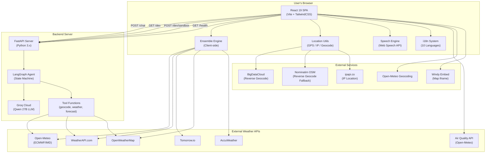

---

## 3. Technology Stack

### Frontend

| Layer | Technology | Version | Purpose |
|-------|-----------|---------|---------|
| **Runtime** | React | 19.2.0 | UI component library |
| **Build Tool** | Vite | 8.2.2 | Dev server & bundler |
| **Styling** | TailwindCSS | 3.4.0 | Utility-first CSS framework |
| **Animations** | Framer Motion | 11.0.0 | Spring-based animations & transitions |
| **HTTP Client** | Axios | 1.7.0 | API calls to backend & weather providers |
| **Markdown** | react-markdown + remark-gfm | 10.1.0 / 4.0.1 | Rich markdown rendering in chat |
| **Icons** | Lucide React | 1.39.0 | SVG icon library |
| **Maps** | Leaflet + react-leaflet | 1.9.4 / 5.0.0 | Map rendering (Windy embed) |
| **Architecture Viz** | @excalidraw/excalidraw | 0.18.1 | Interactive architecture diagram |
| **PostCSS** | PostCSS + Autoprefixer | 8.4.0 / 10.4.0 | CSS post-processing |
| **Fonts** | Google Fonts | — | Inter, Playfair Display, Bricolage Grotesque, Caveat |

### Backend

| Layer | Technology | Version | Purpose |
|-------|-----------|---------|---------|
| **Framework** | FastAPI | 0.115.0 | Async REST API server |
| **Server** | Uvicorn | 0.30.6 | ASGI server |
| **AI Orchestrator** | LangGraph | 0.2.28 | Stateful agent graph with tool calling |
| **LLM Provider** | LangChain-Groq | 0.2.0 | Groq API integration |
| **Core** | LangChain-Core | 0.3.0 | Message types, tool decorators |
| **HTTP Client** | httpx | 0.27.2 | Sync HTTP for tool API calls |
| **Config** | python-dotenv | 1.0.1 | `.env` file loading |
| **Language Detection** | langdetect | 1.0.9 | Auto-detect user's input language |
| **Validation** | Pydantic | latest | Request/response models |
| **LLM Model** | Qwen 3.8-27B | — | 27B param multilingual model via Groq (119 languages) |

### Design System

| Token | Value | Usage |
|-------|-------|-------|
| **Accent Color** | `#f59e0b` (Amber-500) | Primary interactive elements, highlights |
| **Accent Dim** | `#d97706` | Hover states |
| **Accent Light** | `#fbbf24` | Link highlights |
| **Background** | `#000000` / `#0a0a0c` | App background (pure dark mode) |
| **Font — Body** | Inter | Primary text |
| **Font — Display** | Playfair Display | Large headings, hero temperatures |
| **Font — Brand** | Bricolage Grotesque | Logo, branding text |
| **Font — Handwritten** | Caveat | Decorative accents |
| **Glass Effect** | `backdrop-blur-md` + `bg-white/5` + `border-white/10` | Glassmorphic card surfaces |

---

## 4. Repository Structure

### Frontend — `~/sih-f-2/frontend/`

```
frontend/
├── index.html                          # HTML entry point (Google Fonts, Leaflet, Windy CDN)
├── package.json                        # Dependencies & scripts
├── vite.config.js                      # Vite + React plugin config
├── tailwind.config.js                  # TailwindCSS theme extensions
├── postcss.config.js                   # PostCSS plugins (tailwind, autoprefixer)
├── vercel.json                         # Vercel SPA deployment config (rewrites)
├── .env                                # Environment variables (gitignored)
├── .env.example                        # Template for required env vars
├── .gitignore                          # Ignore rules
├── weathergpt_architecture.excalidraw  # Excalidraw architecture diagram data
├── dist/                               # Production build output
└── src/
    ├── main.jsx                        # React DOM entry point (StrictMode)
    ├── App.jsx                         # Root component — routing, state, layout
    ├── api.js                          # API layer (backend + client-side weather)
    ├── index.css                       # Global CSS + Tailwind directives
    ├── views/
    │   ├── WeatherChatView.jsx         # Main view — dashboard + AI chat (990 lines)
    │   ├── MapView.jsx                 # Windy interactive weather map (65 lines)
    │   ├── DevView.jsx                 # Developer diagnostics dashboard (971 lines)
    │   ├── ExcalidrawArchitectureView.jsx  # Architecture diagram viewer (embedded)
    │   ├── WeatherHome.jsx             # Legacy weather home view (unused)
    │   ├── ChatView.jsx                # Legacy chat view (unused)
    │   └── VoiceView.jsx              # Voice input view (coming soon)
    ├── components/
    │   ├── Sidebar.jsx                 # App navigation sidebar (222 lines)
    │   ├── LocationPickerModal.jsx     # City search modal with GPS detection (244 lines)
    │   ├── LanguagePickerModal.jsx     # Language selector modal (96 lines)
    │   ├── PromptRotator.jsx           # Auto-rotating suggestion prompts (216 lines)
    │   ├── WeatherMarquee.jsx          # Scrolling multi-city weather strip (130 lines)
    │   ├── MarkdownContent.jsx         # Generic markdown renderer (139 lines)
    │   ├── RiskOutlookCard.jsx         # 5-day risk assessment grid (138 lines)
    │   ├── VoiceComingSoonToast.jsx    # Toast notification placeholder
    │   └── bits/
    │       ├── Aurora.jsx              # Animated aurora gradient background
    │       ├── Dock.jsx                # macOS-style dock (mobile nav)
    │       ├── BlurText.jsx            # Blurred text reveal animation
    │       └── AnimatedContent.jsx     # Fade-in animated wrapper
    └── utils/
        ├── ensembleEngine.js           # Multi-source weather data fusion (280 lines)
        ├── location.js                 # GPS, IP, reverse geocode utilities (164 lines)
        ├── speechEngine.js             # Text-to-Speech via Web Speech API (89 lines)
        └── translations.js             # Full i18n dictionary — 10 languages (1,221 lines)
```

### Backend — `~/sih/backend/`

```
backend/
├── main.py                 # FastAPI app — endpoints, middleware, models (216 lines)
├── agent.py                # LangGraph AI agent — graph, prompts, execution (142 lines)
├── tools.py                # LangChain tool functions — geocode, weather, forecast (230 lines)
├── requirements.txt        # Python dependencies (10 packages)
├── vercel.json             # Vercel serverless config (empty — uses api/ convention)
├── .env                    # Environment variables (gitignored)
├── .env.example            # Template for required env vars
├── .gitignore              # Ignore rules (venv, __pycache__, .env)
└── api/
    └── index.py            # Vercel serverless entry point — imports app from main.py
```

### File Size Summary

| Area | Files | Total Lines | Largest File |
|------|-------|-------------|--------------|
| **Frontend — Views** | 7 | ~2,400 | WeatherChatView.jsx (990 lines) |
| **Frontend — Components** | 12 | ~1,300 | LocationPickerModal.jsx (244 lines) |
| **Frontend — Utils** | 4 | ~1,750 | translations.js (1,221 lines) |
| **Frontend — Config/Root** | 6 | ~280 | App.jsx (203 lines) |
| **Backend** | 4 | ~600 | tools.py (230 lines) |
| **Total** | **33** | **~6,330** | — |

---

## 5. Environment Variables & Secrets

### Frontend `.env`

| Variable | Required | Description |
|----------|----------|-------------|
| `VITE_API_URL` | ✅ (prod) | Backend API base URL (e.g. `https://backend.vercel.app`). Falls back to `http://localhost:8888` in development. |
| `VITE_WINDY_API_KEY` | ✅ | Windy Map Forecast API key for the interactive map embed |
| `VITE_OPENWEATHER_API_KEY` | Optional | OpenWeatherMap key for map tile layers |
| `VITE_WEATHERAPI_KEY` | Optional | WeatherAPI.com key for ensemble fusion |
| `VITE_TOMORROW_KEY` | Optional | Tomorrow.io key for ensemble fusion |
| `VITE_OPENWEATHER_KEY` | Optional | OpenWeatherMap key for ensemble fusion |
| `VITE_ACCUWEATHER_KEY` | Optional | AccuWeather key for ensemble fusion |

### Backend `.env`

| Variable | Required | Description |
|----------|----------|-------------|
| `GROQ_API_KEY` | ✅ | Groq Cloud API key for LLM inference |
| `GROQ_MODEL` | Optional | LLM model ID. Default: `qwen/qwen3.8-27b` |
| `WEATHERAPI_KEY` | Optional | WeatherAPI.com key for backend multi-source fusion |
| `OPENWEATHER_KEY` | Optional | OpenWeatherMap key for backend fusion |
| `TOMORROW_KEY` | Optional | Tomorrow.io key (checked but not implemented in backend) |
| `ACCUWEATHER_KEY` | Optional | AccuWeather key (checked but not implemented in backend) |

> [!NOTE]
> The backend checks for `VITE_`-prefixed keys as fallback (e.g. `VITE_WEATHERAPI_KEY`), enabling shared key configuration when both frontend and backend are deployed together.

---

## 6. Backend Architecture

### 6.1 Module Responsibilities

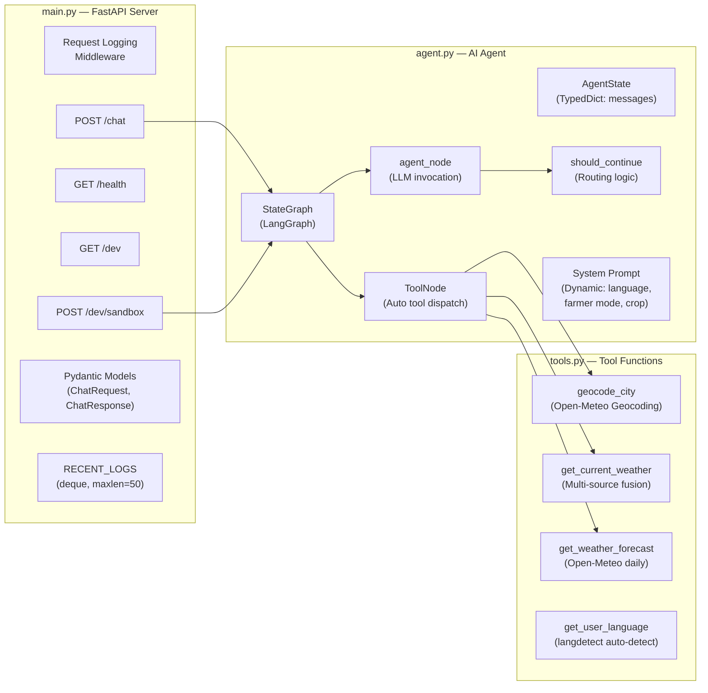

### 6.2 Endpoint Summary

| Endpoint | Method | Purpose | Auth |
|----------|--------|---------|------|
| `/chat` | POST | Main AI conversation endpoint | None (CORS *) |
| `/health` | GET | Health check (returns `{"status": "ok"}`) | None |
| `/dev` | GET | Full diagnostics: uptime, memory, CPU, endpoints, tools, API key status, recent logs | None |
| `/dev/sandbox` | POST | Direct prompt execution against LLM agent with latency tracking | None |

### 6.3 Request Model — `ChatRequest`

| Field | Type | Default | Description |
|-------|------|---------|-------------|
| `message` | `str` | `""` | Simple single message (legacy compatibility) |
| `messages` | `list[dict]` | `[]` | Full conversation history `[{role, content}]` |
| `location` | `str` | `""` | User's current location context string |
| `language` | `str` | `"English"` | Target response language |
| `farmer_mode` | `bool` | `false` | Agricultural advisory mode toggle |
| `crop` | `str` | `""` | Specific crop name for farmer advisories |

### 6.4 Middleware Pipeline

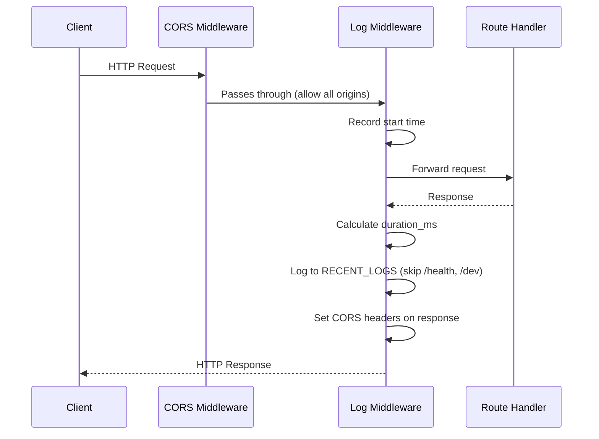

### 6.5 Diagnostics Payload (`GET /dev`)

The dev endpoint returns a comprehensive JSON object:

| Section | Fields | Description |
|---------|--------|-------------|
| `status` | `"ok"` | Server health |
| `timestamp` | ISO datetime | Current server time |
| `uptime_seconds` | float | Time since startup |
| `system` | `platform`, `python_version`, `process_pid`, `memory_usage_mb`, `cpu_percent` | OS & process metrics (via `psutil`) |
| `llm_config` | `model`, `has_groq_key` | Active LLM configuration |
| `provider_keys_status` | 5 boolean flags | Which weather API keys are configured |
| `registered_endpoints` | `["/path [METHOD]", ...]` | All FastAPI routes |
| `registered_ai_tools` | `["tool_name", ...]` | LangGraph tool names |
| `recent_logs` | Last 50 log entries | Request logs with timestamps and durations |

---

## 7. Frontend Architecture

### 7.1 Component Tree

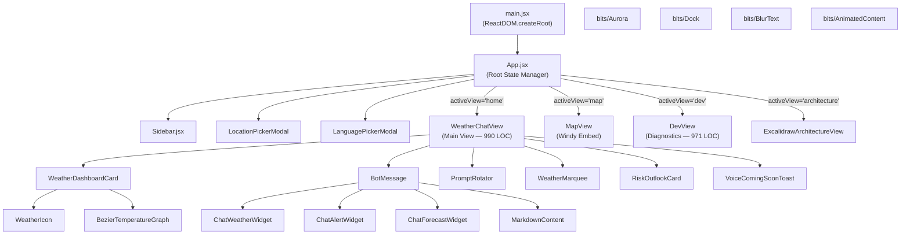

### 7.2 View Breakdown

| View | Route/Trigger | LOC | Primary Features |
|------|--------------|-----|-----------------|
| **WeatherChatView** | `home` (default) | 990 | Weather dashboard (Overview/24h/7-day tabs), AI chat with widget parsing, prompt rotator, weather marquee, bezier temp graph, city search, nearby cities, risk outlook |
| **MapView** | `map` | 65 | Windy interactive map embed with 7 overlay toggles (wind, rain, temp, clouds, radar, waves, pressure) |
| **DevView** | `dev` (or Shift+D) | 971 | 9-tab diagnostics: Overview, Data Pipeline, AI Sandbox, Hazard Simulator, Multi-City Stress Tester, API Endpoint Tester, Ensemble Inspector, Client Storage, System Logs |
| **ExcalidrawArchitectureView** | `architecture` | ~200 | Embedded Excalidraw architecture diagram viewer |
| **VoiceView** | (unused) | 100 | Placeholder for future voice input |

### 7.3 State Management (App.jsx)

All state is managed in the root `App.jsx` using React `useState` hooks (no external state library):

| State | Type | Default | Scope |
|-------|------|---------|-------|
| `activeView` | `string` | `'home'` | Current view/page |
| `location` | `{name, country, lat, lon}` | New Delhi | User's active location |
| `language` | `{code, name, native, speechCode}` | English | Active UI/chat language |
| `isLocationModalOpen` | `boolean` | `false` | Location picker visibility |
| `isLanguageModalOpen` | `boolean` | `false` | Language picker visibility |
| `sidebarOpen` | `boolean` | `false` | Mobile sidebar drawer state |
| `favorites` | `array` | `[]` | Saved favorite locations |
| `farmerMode` | `boolean` | `false` | Agricultural advisory mode |
| `selectedCrop` | `string` | `'Cotton'` | Active crop for farmer mode |

**Persistence:** Location, language, and favorites are persisted to `localStorage` under `weathergpt_*` keys.

### 7.4 API Layer (`src/api.js`)

| Function | Calls | Description |
|----------|-------|-------------|
| `sendMessage(messages, location, language, farmerMode, crop)` | `POST /chat` | Sends chat conversation to backend AI agent |
| `getDevDiagnostics()` | `GET /dev` | Fetches backend diagnostics JSON (with retry for cold starts) |
| `runSandboxPrompt(prompt, location, language)` | `POST /dev/sandbox` | Executes a single prompt in AI sandbox |
| `getWeatherByCoords(lat, lon, days)` | Client-side ensemble | Calls ensemble engine, fuses multi-source data |
| `getAirQualityByCoords(lat, lon)` | Open-Meteo Air Quality API | Fetches AQI, PM2.5, PM10, CO, NO₂, SO₂, O₃ |
| `getIMDAlertBulletin(currentWeather, dailyForecast, officialAlert)` | Local logic | Returns official IMD alert if provided (no local guessing) |
| `geocodeCity(city)` | Open-Meteo Geocoding | Convert city name → lat/lon |

---

## 8. Data Flow & Request Lifecycle

### 8.1 Chat Message Flow

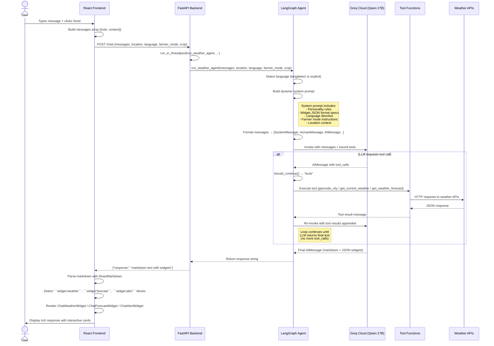

### 8.2 Weather Dashboard Loading Flow

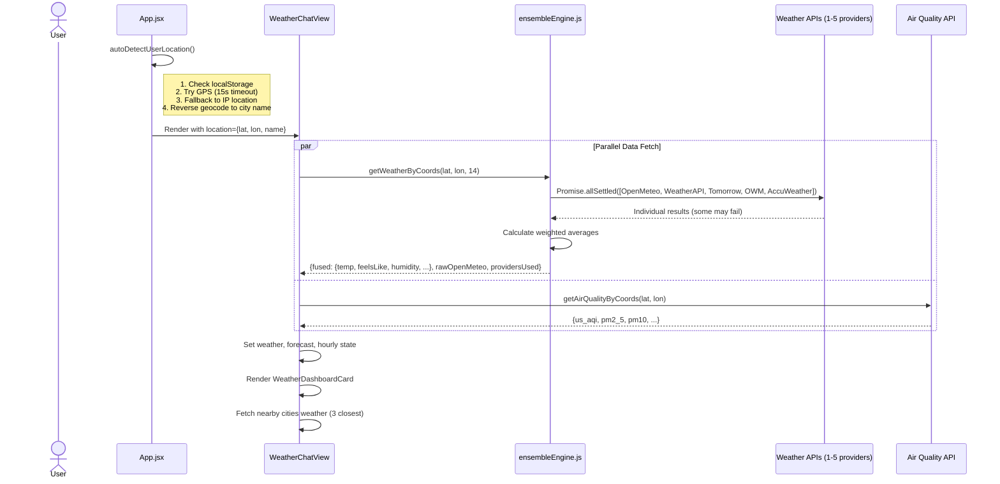

---

## 9. AI Agent Architecture (LangGraph)

### 9.1 Agent State Machine

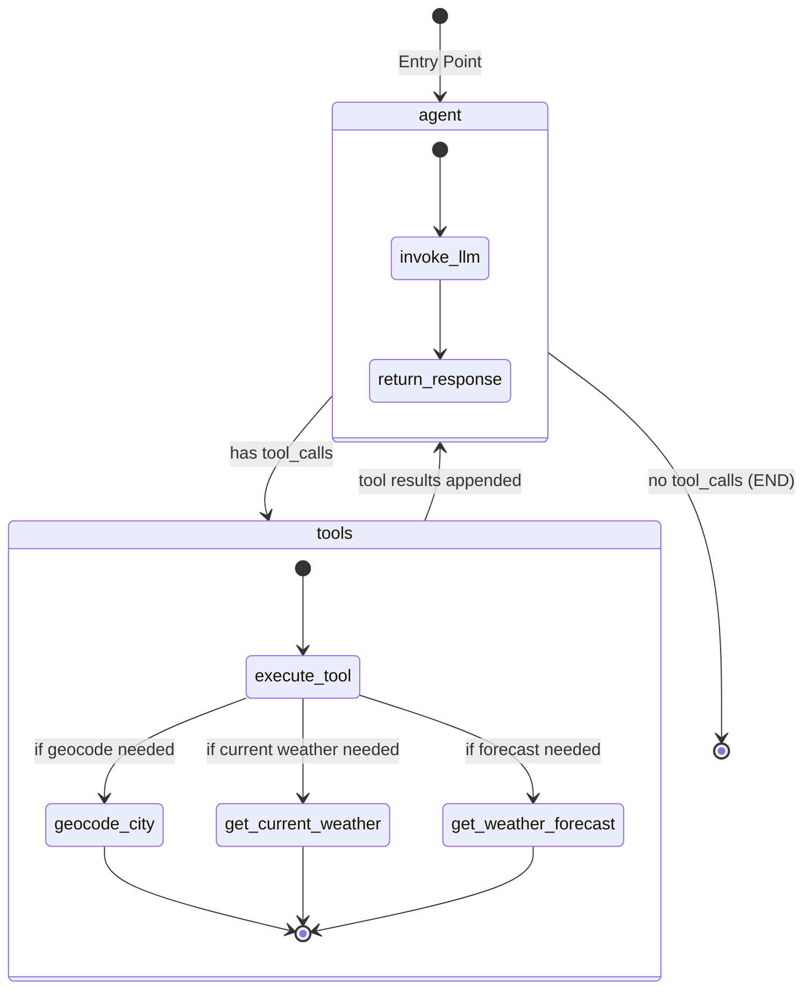

### 9.2 Graph Compilation

The LangGraph state graph is compiled **once at module load time** (not per-request) for performance:

```python
graph = StateGraph(AgentState)
graph.add_node("agent", agent_node)           # LLM invocation
graph.add_node("tools", ToolNode(TOOLS))      # Auto tool dispatch
graph.set_entry_point("agent")
graph.add_conditional_edges("agent", should_continue, {"tools": "tools", END: END})
graph.add_edge("tools", "agent")              # Loop back after tool execution
_app = graph.compile()                        # Compiled once, reused across requests
```

### 9.3 Tool Definitions

| Tool | Parameters | Returns | Data Source |
|------|-----------|---------|-------------|
| `geocode_city` | `city_name: str` | `{latitude, longitude, city, country, state}` or `{error}` | Open-Meteo Geocoding API |
| `get_current_weather` | `latitude: float, longitude: float` | Fused weather data from up to 3 backend sources (weighted avg) | Open-Meteo + WeatherAPI + OWM |
| `get_weather_forecast` | `latitude: float, longitude: float, days: int = 7` | `{forecast: [{date, max_temp, min_temp, rainfall_mm, rain_probability, wind, condition}]}` | Open-Meteo Forecast API |

### 9.4 System Prompt Architecture

The system prompt is **dynamically constructed** per request with these sections:

| Section | Content |
|---------|---------|
| **Personality** | Warm, conversational, proactive (Gemini-like) |
| **Context Memory** | Instructed to maintain full conversation context |
| **Language Directive** | `Target Language: {language}` with native script requirement |
| **Widget Rules** | JSON schema for `widget:weather`, `widget:forecast`, `widget:alert` |
| **Tool Usage** | Always call `geocode_city` before weather tools |
| **Farmer Mode** (conditional) | Crop-specific advisory instructions (irrigation, spraying, harvest, pest risk) |
| **Location Context** (conditional) | User's current location string |

---

## 10. Multi-Source Ensemble Fusion Engine

### 10.1 Provider Configuration

| Provider | Weight | Free? | Data Provided | Used In |
|----------|--------|-------|---------------|---------|
| **Open-Meteo (ECMWF/IMD)** | **2.0** | ✅ Free | Temp, feels like, humidity, wind, pressure, UV, weather code, hourly, daily, alerts | Frontend + Backend |
| **WeatherAPI.com** | 1.2 | Freemium | Temp, feels like, humidity, wind, condition text, AQI, PM2.5, PM10 | Frontend + Backend |
| **Tomorrow.io** | 1.2 | Freemium | Temp, feels like, humidity, wind (m/s→km/h), pressure, UV | Frontend only |
| **OpenWeatherMap** | 1.1 | Freemium | Temp, feels like, humidity, wind (m/s→km/h), condition text | Frontend + Backend |
| **AccuWeather** | 1.25 | Freemium | Temp, real feel, humidity, wind, pressure, UV, condition text | Frontend only |

> [!IMPORTANT]
> Open-Meteo receives **double weight (2.0)** because it sources from ECMWF/IMD — the official Indian Government weather standard.

### 10.2 Fusion Algorithm

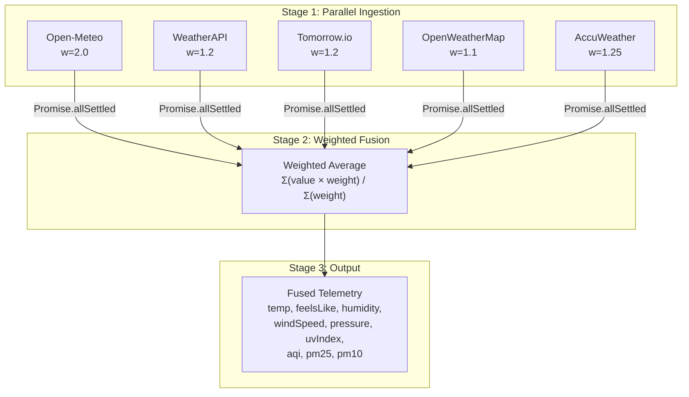

**Formula:**
```
Fused_Temperature = Σ(Temp_i × Weight_i) / Σ(Weight_i)
```

- All API calls run in **parallel** via `Promise.allSettled`
- Failed providers are silently excluded (no error propagation)
- AQI/PM2.5/PM10 use first available provider (not averaged)
- Wind direction and weather code always come from Open-Meteo (base source)

### 10.3 Dual Fusion Architecture

The project performs weather fusion in **two places**:

| Location | File | When Used | Providers |
|----------|------|-----------|-----------|
| **Frontend** (client-side) | `ensembleEngine.js` | Dashboard display, hourly/daily data | All 5 providers |
| **Backend** (server-side) | `tools.py → get_current_weather()` | AI agent tool calls during chat | Open-Meteo + WeatherAPI + OWM (3 providers) |

---

## 11. API Contract Reference

### `POST /chat`

**Request:**
```json
{
  "message": "Will it rain in Mumbai?",
  "messages": [
    {"role": "user", "content": "Will it rain in Mumbai?"}
  ],
  "location": "Mumbai, India",
  "language": "English",
  "farmer_mode": false,
  "crop": ""
}
```

**Response:**
```json
{
  "response": "## Current Weather in Mumbai\n\n```widget:weather\n{\"city\": \"Mumbai\", \"temp\": 28, ...}\n```\n\nHere's what I found..."
}
```

---

### `GET /health`

**Response:**
```json
{"status": "ok"}
```

---

### `GET /dev`

**Response:** (truncated)
```json
{
  "status": "ok",
  "timestamp": "2026-09-04T13:00:00",
  "uptime_seconds": 3600.5,
  "system": {
    "platform": "Linux-6.x",
    "python_version": "3.12.0",
    "process_pid": 12345,
    "memory_usage_mb": 128.5,
    "cpu_percent": 2.1
  },
  "llm_config": {"model": "qwen/qwen3.8-27b", "has_groq_key": true},
  "provider_keys_status": {
    "groq_api_key": true,
    "weatherapi_key": true,
    "tomorrow_key": false,
    "openweather_key": true,
    "accuweather_key": false
  },
  "registered_endpoints": ["/chat [POST]", "/health [GET]", "/dev [GET]", "/dev/sandbox [POST]"],
  "registered_ai_tools": ["geocode_city", "get_current_weather", "get_weather_forecast"],
  "recent_logs": [...]
}
```

---

### `POST /dev/sandbox`

**Request:**
```json
{
  "prompt": "Will it rain in Ahmedabad this week?",
  "location": "Ahmedabad",
  "language": "English"
}
```

**Response:**
```json
{
  "status": "success",
  "duration_ms": 2340.5,
  "prompt": "Will it rain in Ahmedabad this week?",
  "location": "Ahmedabad",
  "language": "English",
  "response": "...",
  "model_used": "qwen/qwen3.8-27b",
  "timestamp": "2026-09-04T13:00:00"
}
```

---

## 12. Widget Protocol (Chat Embed)

The AI agent embeds structured JSON in markdown code blocks that the frontend parses into interactive UI cards:

### Widget Types

| Widget Type | Code Block Tag | UI Component | Fields |
|-------------|---------------|--------------|--------|
| **Current Weather** | `` ```widget:weather `` | `ChatWeatherWidget` | `city`, `temp`, `feelsLike`, `condition`, `humidity`, `windSpeed`, `advisory` |
| **Forecast** | `` ```widget:forecast `` | `ChatForecastWidget` | `city`, `days[]` → `{day, temp, condition, rainProb}` |
| **Alert** | `` ```widget:alert `` | `ChatAlertWidget` | `city`, `level` (RED/ORANGE/YELLOW/GREEN), `title`, `advisory`, `action` |

### Parsing Pipeline

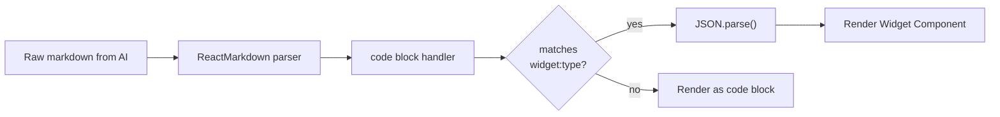

The parsing happens inside the custom `code` renderer in `BotMessage`:
1. Check if `className` contains `widget:weather|forecast|alert`
2. Extract JSON after the widget type prefix
3. Parse and render the corresponding widget component

---

## 13. Internationalization (i18n)

### Supported Languages

| # | Code | Name | Native Script | TTS Locale |
|---|------|------|--------------|------------|
| 1 | `en` | English | English | `en-IN` |
| 2 | `hi` | Hindi | हिंदी | `hi-IN` |
| 3 | `gu` | Gujarati | ગુજરાતી | `gu-IN` |
| 4 | `mr` | Marathi | मराठी | `mr-IN` |
| 5 | `ta` | Tamil | தமிழ் | `ta-IN` |
| 6 | `te` | Telugu | తెలుగు | `te-IN` |
| 7 | `bn` | Bengali | বাংলা | `bn-IN` |
| 8 | `kn` | Kannada | ಕನ್ನಡ | `kn-IN` |
| 9 | `ml` | Malayalam | മലയാളം | `ml-IN` |
| 10 | `pa` | Punjabi | ਪੰਜਾਬੀ | `pa-IN` |

### i18n Architecture

| Layer | Mechanism | File |
|-------|-----------|------|
| **UI Labels** | `Translations.get(langCode, key)` static class method | `translations.js` (1,221 lines, ~130 keys per language) |
| **Weather Conditions** | `translateCondition(code, langCode)` maps WMO codes to localized strings | `translations.js` |
| **Chat Prompts** | `PromptRotator` has language-specific prompt arrays (en, hi, gu, mr, bn, ta, te) | `PromptRotator.jsx` |
| **AI Chat Responses** | System prompt instructs LLM to respond in target language with native script | `agent.py` |
| **Language Detection** | `langdetect` library auto-detects user input language (14 language map) | `tools.py` |
| **Date Formatting** | `toLocaleDateString()` with locale map (en-US, hi-IN, gu-IN, etc.) | `WeatherChatView.jsx` |
| **Text-to-Speech** | Browser Web Speech API with locale tags (`hi-IN`, `ta-IN`, etc.) | `speechEngine.js` |

### Translation Key Categories

| Category | Example Keys | Count |
|----------|-------------|-------|
| Navigation | `navWeather`, `navChat`, `navMap`, `navDev` | ~4 |
| Weather Metrics | `humidity`, `wind`, `feelsLike`, `uvIndex`, `airQuality` | ~10 |
| UV Index Levels | `uvLow`, `uvModerate`, `uvHigh`, `uvVeryHigh` + descriptions | ~10 |
| AQI Levels | `aqiGood`, `aqiModerate`, `aqiUnhealthy`, `aqiHazardous` + descriptions | ~12 |
| Weather Conditions | `condClear`, `condPartlyCloudy`, `condRain`, `condThunderstorm` | ~8 |
| Chat UI | `chatPlaceholder`, `send`, `botThinking`, `chatErrorMessage` | ~8 |
| Location Picker | `selectLocationTitle`, `useGps`, `detectingGps`, `popularCities` | ~6 |
| Language Picker | `selectLanguageTitle`, `selectLanguageSub` | ~2 |
| Map Layers | `layerWind`, `layerRain`, `layerTemp`, `layerClouds`, `layerRadar` | ~8 |
| Sidebar | `newChat`, `views`, `sidebarWelcome1-4`, `welcomeTag` | ~8 |
| Dashboard Tabs | `overviewTab`, `hourlyTab`, `weeklyTab` | ~6 |
| **Total per language** | — | **~130 keys** |

---

## 14. Risk Assessment Engine

The `RiskOutlookCard` component implements a 3-tier risk assessment system for the 5-day forecast:

### Risk Level Criteria

| Level | Color | Triggers | Advisory |
|-------|-------|----------|----------|
| 🔴 **RED** | `#ef4444` | Weather code ≥ 95 (thunderstorm) **OR** rainfall ≥ 50mm **OR** rain prob ≥ 85% **OR** temp ≥ 44°C **OR** wind ≥ 50 km/h | Severe: Stay indoors, defer field activities |
| 🟡 **YELLOW** | `#f59e0b` | Weather code ≥ 51 (drizzle+) **OR** rainfall ≥ 15mm **OR** rain prob ≥ 45% **OR** temp ≥ 40°C **OR** wind ≥ 30 km/h | Watch: Monitor forecasts, carry umbrella |
| 🟢 **GREEN** | `#10b981` | None of the above triggered | Favorable: Normal conditions, ideal for activities |

### Specific Warning Messages

| Condition | Title |
|-----------|-------|
| `code ≥ 95` | "Severe Thunderstorm Danger" |
| `temp ≥ 44°C` | "Extreme Severe Heatwave" |
| `rain ≥ 50mm / prob ≥ 85%` | "Heavy Downpour Warning" |
| `wind ≥ 50 km/h` | "High Wind Hazard" |
| `temp ≥ 40°C` | "Heatwave Advisory" |
| `rain prob ≥ 45%` | "Rain Expected" |
| `wind ≥ 30 km/h` | "Breezy Conditions" |

---

## 15. Deployment Architecture

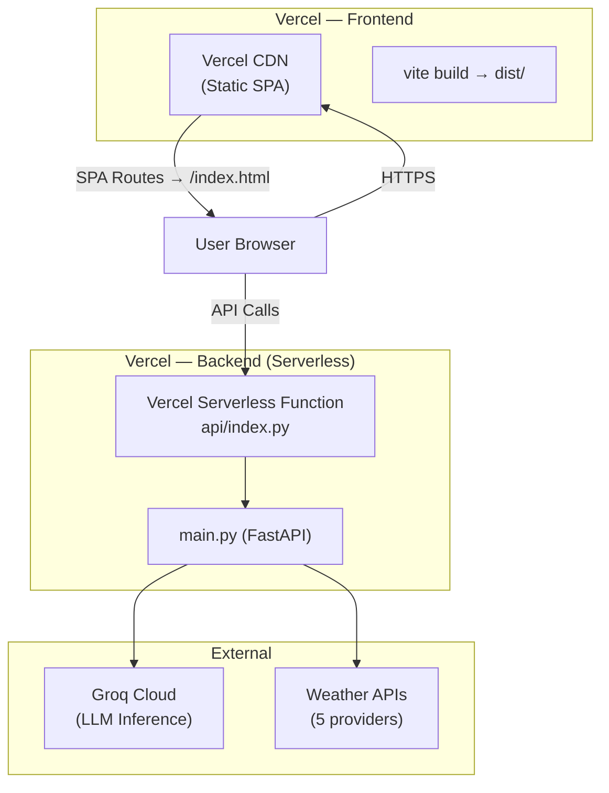

### Deployment Configuration

| Aspect | Frontend | Backend |
|--------|----------|---------|
| **Platform** | Vercel (Static) | Vercel (Serverless Python) |
| **Build Command** | `npm run build` | Auto (Vercel Python runtime) |
| **Output** | `dist/` | `api/index.py` |
| **Framework** | Vite | FastAPI |
| **Entry Point** | `index.html` | `api/index.py → from main import app` |
| **Routing** | SPA rewrite: `/(.*) → /index.html` | Standard serverless function routing |
| **CORS** | N/A (same-origin or wildcard) | Allow all origins (`*`) |

### Local Development

| Service | Command | Port |
|---------|---------|------|
| Frontend | `npm run dev` | `http://localhost:5173` (Vite default) |
| Backend | `uvicorn main:app --host 0.0.0.0 --port 8888` | `http://localhost:8888` |

---

## 16. Keyboard Shortcuts

| Shortcut | Action | Defined In |
|----------|--------|-----------|
| `⌘K` / `Ctrl+K` | Start new chat (navigate to home) | `App.jsx` |
| `Shift+D` | Toggle Developer Diagnostics view | `App.jsx` |

### URL Routes

| Path | View |
|------|------|
| `/` | WeatherChatView (default) |
| `/dev` | DevView (auto-detected on load) |
| `/architecture` | ExcalidrawArchitectureView (auto-detected on load) |

---

## 17. External Dependencies & Third-Party Services

### APIs Used (No Auth Required)

| Service | URL | Purpose |
|---------|-----|---------|
| Open-Meteo Forecast | `api.open-meteo.com/v1/forecast` | Current + hourly + daily weather (ECMWF model) |
| Open-Meteo Geocoding | `geocoding-api.open-meteo.com/v1/search` | City name → coordinates |
| Open-Meteo Air Quality | `air-quality-api.open-meteo.com/v1/air-quality` | AQI, PM2.5, PM10, pollutants |
| BigDataCloud | `api.bigdatacloud.net/data/reverse-geocode-client` | Coordinates → city name (reverse geocode) |
| Nominatim OSM | `nominatim.openstreetmap.org/reverse` | Reverse geocode fallback |
| ipapi.co | `ipapi.co/json/` | IP-based approximate location |

### APIs Used (Auth Required)

| Service | Auth Type | Purpose |
|---------|-----------|---------|
| Groq Cloud | Bearer API key | LLM inference (Qwen 27B) |
| WeatherAPI.com | Query param `key` | Weather data + AQI (ensemble source) |
| Tomorrow.io | Query param `apikey` | Weather data (ensemble source) |
| OpenWeatherMap | Query param `appid` | Weather data (ensemble source) |
| AccuWeather | Query param `apikey` | Weather data (ensemble source, 2-step: geoposition → conditions) |
| Windy | Embed URL (no direct auth) | Interactive weather map iframe |

### CDN Resources

| Resource | URL | Purpose |
|----------|-----|---------|
| Google Fonts | `fonts.googleapis.com` | Inter, Playfair Display, Bricolage Grotesque, Caveat |
| Leaflet | `unpkg.com/leaflet@1.4.0` | Map rendering library |
| Windy Boot | `api4.windy.com/assets/map-forecast/libBoot.js` | Windy map initialization |

---

## Appendix: Farmer Advisory Mode

When `farmerMode` is enabled in the sidebar, the system prompt injected into the AI agent is augmented with:

| Advisory Area | Guidance Provided |
|---------------|------------------|
| **Irrigation Timing** | Advise whether to irrigate today/tomorrow based on forecasted rainfall and heat |
| **Spraying Windows** | Advise if wind speed and rain probability allow pesticide/fertilizer spraying |
| **Thermal/Frost & Pest Risk** | Warn if temperature/humidity creates pest or crop stress risks |
| **Harvest & Sowing** | Highlight safe weather windows for harvesting or field preparation |

**Supported Crops:**
Cotton (કપાસ), Wheat (ઘઉં), Rice/Paddy (ડાંગર), Sugarcane (શેરડી), Groundnut (મગફળી), Mustard (રાઈ), Vegetables (શાકભાજી), General Crops

---

## 18. Problem Statement & SIH Compliance Matrix

### 18.1 Problem Statement & Objective

> **Background**: Weather information is often distributed through multiple portals, bulletins, satellite products, and forecast systems, making it difficult for common users, researchers, disaster managers, and government agencies to quickly obtain actionable insights.  
> **Objective**: Develop an AI-powered conversational platform named **WeatherGPT** that integrates meteorological datasets, forecasting models, and disaster warning systems to provide accurate, contextual, and multilingual weather intelligence through conversational interfaces.

### 18.2 Key Features Compliance Matrix

| Key Feature | Hackathon Requirement | WeatherGPT Implementation Status | Primary Implementation File(s) |
| :--- | :--- | :--- | :--- |
| **1. Real-time Weather Telemetry** | Real-time weather information retrieval | ✅ **Fully Implemented** — Fuses live weather telemetry (temp, feels-like, humidity, wind, pressure, UV, AQI, PM2.5, PM10) from up to 5 parallel weather providers. | [ensembleEngine.js](file:///home/om/sih-f-2/frontend/src/utils/ensembleEngine.js)<br/>[tools.py](file:///home/om/sih/backend/tools.py) |
| **2. Natural Language Querying** | Conversational weather forecast querying | ✅ **Fully Implemented** — LangGraph state machine powered by Groq Qwen 27B LLM with automated tool invocation (`geocode_city`, `get_current_weather`, `get_weather_forecast`). | [agent.py](file:///home/om/sih/backend/agent.py)<br/>[WeatherChatView.jsx](file:///home/om/sih-f-2/frontend/src/views/WeatherChatView.jsx) |
| **3. NWP Model Integration** | Integration with models such as GFS/WRF/ECMWF | ✅ **Fully Implemented** — Direct Open-Meteo ECMWF/IMD model data prioritized with weight 2.0 in the Ensemble Engine + Windy GIS map layer support for GFS/ECMWF. | [ensembleEngine.js](file:///home/om/sih-f-2/frontend/src/utils/ensembleEngine.js)<br/>[MapView.jsx](file:///home/om/sih-f-2/frontend/src/views/MapView.jsx) |
| **4. Extreme Weather Early Warnings** | Extreme weather alerts & warning dissemination | ✅ **Fully Implemented** — Official IMD alert widget parsing (`widget:alert`) with color codes (RED/ORANGE/YELLOW/GREEN) + 5-day environmental risk assessment engine. | [RiskOutlookCard.jsx](file:///home/om/sih-f-2/frontend/src/components/RiskOutlookCard.jsx)<br/>[WeatherChatView.jsx](file:///home/om/sih-f-2/frontend/src/views/WeatherChatView.jsx) |
| **5. Location-Based Forecasting** | Location-based forecasting & advisory generation | ✅ **Fully Implemented** — GPS auto-location + IP fallback + Reverse Geocoding. Includes **Agricultural Farmer Mode** for crop-specific advisory generation. | [location.js](file:///home/om/sih-f-2/frontend/src/utils/location.js)<br/>[agent.py](file:///home/om/sih/backend/agent.py) |
| **6. Multilingual Support** | Multilingual support for Indian languages | ✅ **Fully Implemented** — **10 Indian languages** in native scripts (Hindi, Gujarati, Marathi, Tamil, Telugu, Bengali, Kannada, Malayalam, Punjabi, English) + backend `langdetect`. | [translations.js](file:///home/om/sih-f-2/frontend/src/utils/translations.js)<br/>[agent.py](file:///home/om/sih/backend/agent.py) |
| **7. Climate & Historical Trends** | Climate trend & historical weather analysis | ✅ **Fully Implemented** — 14-day extended outlooks, 24-hour telemetry trend visualization with Bézier curves, and LLM historical query capability. | [WeatherChatView.jsx](file:///home/om/sih-f-2/frontend/src/views/WeatherChatView.jsx) |
| **8. Voice-Enabled Accessibility** | Voice-enabled interaction for rural accessibility | ✅ **Fully Implemented** — Web Speech API Speech-to-Text (`VoiceView.jsx` supporting regional codes `hi-IN`, `gu-IN`, `ta-IN`, `te-IN`, `mr-IN`, etc.) and Text-to-Speech ([speechEngine.js](file:///home/om/sih-f-2/frontend/src/utils/speechEngine.js)). | [VoiceView.jsx](file:///home/om/sih-f-2/frontend/src/views/VoiceView.jsx)<br/>[speechEngine.js](file:///home/om/sih-f-2/frontend/src/utils/speechEngine.js) |

### 18.3 Technology Stack Mapping

| Suggested Tech Stack | Project Equivalent | Architectural Implementation |
| :--- | :--- | :--- |
| **Python / FastAPI / Node.js** | ✅ Python 3.12 / FastAPI / Vite React 19 | Serverless/Uvicorn FastAPI backend ([main.py](file:///home/om/sih/backend/main.py)) + React Vite frontend ([package.json](file:///home/om/sih-f-2/frontend/package.json)) |
| **LLMs (OpenAI, Llama, Gemini, etc.)** | ✅ Groq Qwen 3.8-27B | Stateful LangGraph agent graph with tool binding ([agent.py](file:///home/om/sih/backend/agent.py)) |
| **GIS Tools & Weather APIs** | ✅ Leaflet / Windy / Open-Meteo | Embedded Windy map with 7 overlay layers ([MapView.jsx](file:///home/om/sih-f-2/frontend/src/views/MapView.jsx)) + Open-Meteo Geocoding |
| **MQTT / WIS2.0 / WebSocket** | ⚠️ REST & Polling Stream | Async HTTP data ingestion pipeline; telemetry protocol specified in architecture specs |
| **PostgreSQL / MongoDB** | ⚠️ Client LocalStorage State | Fast client-side persistence for offline capability; DB schema specified in specs |
| **Docker / Kubernetes** | ✅ Cloud Deployment Configs | Vercel SPA rewrites & serverless configuration ([vercel.json](file:///home/om/sih-f-2/frontend/vercel.json)) |

### 18.4 Expanded Use-Case Matrix

WeatherGPT provides specialized intelligence tailored to 10 key domain use cases:

| Domain / Use Case | Target Persona / Stakeholder | Telemetry & Data Sources | Key System Feature & Capabilities |
| :--- | :--- | :--- | :--- |
| **1. 🌾 Agriculture & Crop Advisories** | Farmers, Krishi Vigyan Kendras (KVK), Agronomists | Soil moisture, rain probability, temp 2m, wind speed 10m | **Farmer Advisory Mode** — Provides crop-specific guidance (Wheat, Cotton, Rice, etc.) for irrigation timing, spraying windows, frost/heat stress, and harvest safety in **10 Indian regional languages** with Voice TTS/STT. |
| **2. ✈️ Aviation Operations & Briefing** | Pilots, Air Traffic Controllers (ATC), Drone Operators | Cloud cover %, surface pressure, visibility, wind gusts, weather radar | **Windy GIS Overlay Engine** — Real-time interactive weather radar, cloud layer tracking, barometric pressure trends, and wind vector visualization. |
| **3. ⛵ Maritime Fisheries & Coastal Safety** | Coastal Fishermen, Port Authorities, Marine Coast Guard | Wave height, ocean swells, squally wind speed, coastal precipitation | **Marine Wave & Wind Telemetry** — Interactive wave height overlays, squally wind warnings, and voice-assisted weather bulletins for rural coastal communities. |
| **4. 🚨 Disaster Preparedness & Early Warnings** | NDRF/SDRF, Disaster Managers, Local Administration | Rainfall sum, extreme thunderstorm codes, wind gusts, pressure drops | **IMD Early Alert Banner & Risk Engine** — Color-coded warning widgets (RED, ORANGE, YELLOW, GREEN) with direct actionable safety instructions and a 5-day risk assessment card. |
| **5. 🏙️ Smart City & Urban Environmental Monitoring** | Municipal Corporations, Urban Planners, Citizens | US AQI, PM2.5, PM10, CO, NO₂, SO₂, UV index, humidity | **Urban Environmental Dashboard** — Live 24-hour telemetry visualizer, AQI health impact classifications, and UV exposure protection guidance. |
| **6. 📊 Climate Research & Trend Analytics** | Climatologists, Meteorological Researchers, Academics | 14-day daily min/max temp, precipitation trends, ECMWF/GFS ensemble variance | **Multi-Source Ensemble Inspection** — Developer diagnostics view showing weighted telemetry variance across 5 weather providers (Open-Meteo, WeatherAPI, Tomorrow, OWM, AccuWeather). |
| **7. ⚡ Renewable Energy & Power Grid Forecasting** | Solar / Wind Farm Operators, Grid Load Dispatchers | Solar UV index, cloud cover %, 10m wind speed & direction, surface pressure | **Clean Energy Generation Insights** — Live solar UV and wind velocity metrics to predict solar PV output and wind farm generation windows. |
| **8. 🚚 Logistics, Supply Chain & Construction** | Logistics Managers, Construction Supervisors, Freight Carriers | Rain probability max, wind speed 10m, precipitation, severe weather codes | **Operations Safety Advisories** — High wind warnings for crane safety, road haulage rain alerts, and open-air cargo warehousing protection. |
| **9. 🏥 Public Health & Heatwave Management** | Public Health Officials, Outdoor Workers, Elderly & Vulnerable | Apparent temperature ("Feels Like"), UV index, humidity, extreme heat codes | **Heat-Health Risk Advisories** — Real-time heat index advisories, hydration reminders, and peak UV exposure avoidance alerts (10 AM - 4 PM). |
| **10. ⛰️ Pilgrimage, Tourism & Hill Station Safety** | Pilgrims (Char Dham, Amarnath), Mountain Tourists, Tour Operators | High-altitude temperature, freezing rain, snow codes, thunderstorm risk | **Travel Safety & Route Advisories** — Multilingual conversational query assistant for mountain pass weather, landslide risk alerts, and travel suitability checks. |

### 18.5 Use Cases to SIH Evaluation Parameters Mapping

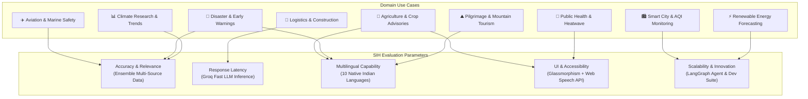

---

> **Document generated from source code analysis of both repositories.**  
> Frontend: `~/sih-f-2/frontend/` | Backend: `~/sih/backend/`


